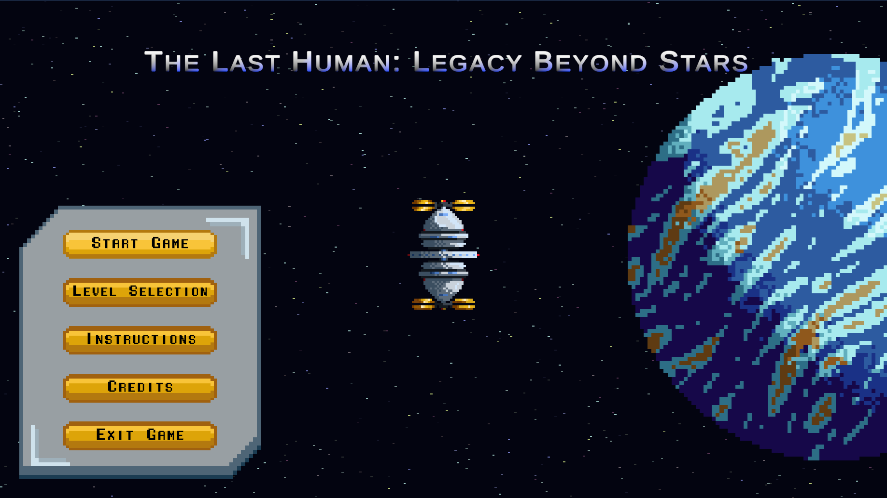
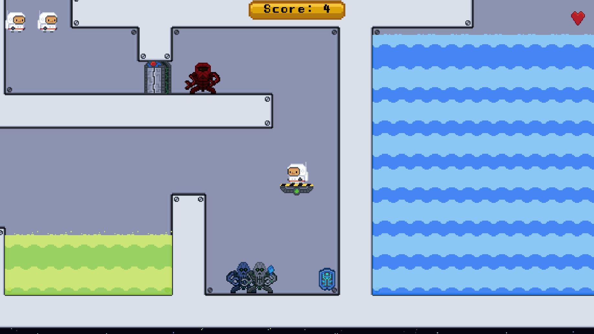
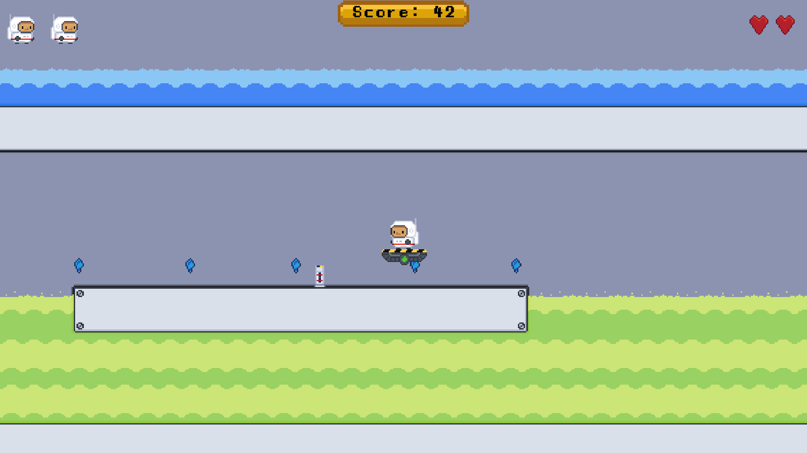
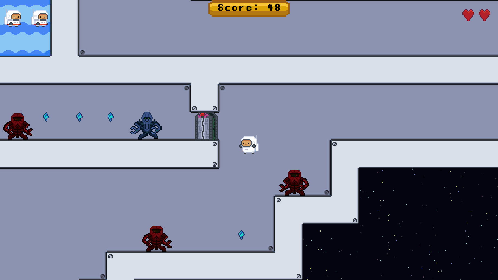

# 👽 TheLastHuman

**TheLastHuman** is a fast-paced 2D platformer made in Unity, where you play as the last surviving human fighting to reclaim alien-infested worlds. Traverse hostile terrain, outmaneuver enemy bots, and uncover the mystery of humanity’s fall — all while mastering fluid WASD movement and double-jump platforming.

---

## 🎮 Controls

- **W / A / S / D** — Move your character  
- **Spacebar** — Jump  
- **Double Spacebar** — Double Jump

---

## 🎮 Play Soon

[Play Here](https://abhisheksbiju.itch.io/thelasthuman) !

---

## 📷 Screenshots

### 🪐 MainMenu Preview

### 🪐 Gameplay Preview
  
  

---

## 🌟 Features

- 🌌 **Alien Worlds**: Explore hand-crafted levels set in mysterious environments  
- 🤖 **Enemy AI**: Face off against unique bot types with pathfinding and behavior logic  
- ⬆️ **Double Jump Mechanic**: Adds vertical freedom to classic platforming  
- 🎧 **Immersive Audio**: Includes atmospheric music and sound effects  
- 🔁 **Progressive Challenge**: Each level ramps up difficulty and enemy types

---

## 🛠️ Built With

- **Unity (2D)**  
- **C#**  
- **Custom-made enemy bots with pathfinding**  
- **Sound effects & background music** for immersive experience

---

## 📁 Project Structure

***TheLastHuman***

- Library (Not included in GitHub — size concerns)
- Assets (Not included in GitHub — only Scripts folder included)
- Packages (Not included in GitHub — size concerns)
- ProjectSettings/ (Not included in GitHub)
- Build/ (Included in README.md)
- ScreenShots/ (Not included in GitHub)
- .gitignore
- LICENSE
- README.md

---

## 📦 In Development

- 🦾 Boss battles  
- 🔫 Combat system with ranged/melee options  
- 📜 Cutscene-driven storytelling  
- 💾 Save/load system  
- 🪐 More levels and enemy types

---

Feel free to fork, star, or contribute!

